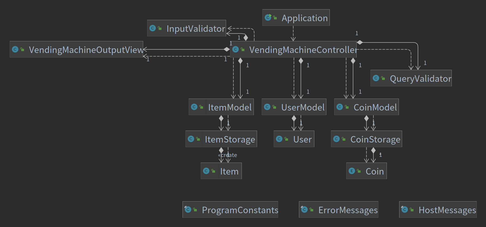

## 🚀 기능 요구사항

- [x] 자판기가 보유하고 있는 금액을 입력받는다.
  - [예외]아무것도 입력하지 않을경우 `IllegalArgumentException`를 발생시키고, "[ERROR] 빈칸을 입력하실 수 없습니다."를 출력한 후 재입력받는다.
  - [예외]금액이 자연수가 아닌경우 `IllegalArgumentException`를 발생시키고, "[ERROR] 금액은 자연수여야 합니다."를 출력한 후 재입력받는다.
  - [예외]10의 배수가 아닌경우 `IllegalArgumentException`를 발생시키고, "[ERROR] 보유한 금액은 10의 배수여야 합니다."를 출력 후 재입력받는다.
- [x] 자판기가 보유한 금액만큼의 동전을 무작위로 생성한다.
  - 생성한 금액은 정확하게 맞아떨어져야 한다.
- [x] 자판기가 보유한 동전을 500원, 100원, 50원, 10원 순으로 출력한다.
  - 0개인 동전도 출력한다.
- [x] 자판기가 유지할 상품명과 가격, 수량을 입력받는다.
  - 입력받는 형식은 [상품명,가격,수량]이며, 여러개를 입력할 때는 ;(세미콜론)으로 구분한다.
  - [예외]상품을 하나도 입력하지 않는경우 `IllegalArgumentException`를 발생시키고, "[ERROR] 최소 하나의 상품을 입력해주세요."를 출력 후 재입력받는다.
  - [예외]대괄호 밖에 세미콜론 이외의 문자가 포함되어있거나, 대괄호의 짝이 맞지 않으면 `IllegalArgumentException`를 발생시키고, "[ERROR] [상품명,가격,수량]
    ;[상품명,가격,수량]의 형식을 맞춰서 입력해주세요."를 출력 후 재입력받는다.
  - [예외]대괄호 안에 3개의 항목이 들어있지 않으면 `IllegalArgumentException`를 발생시키고, "[ERROR] [상품평,가격,수량] 3항목을 입력해주세요."를 출력 후 재입력받는다.
  - [예외]가격이 자연수가 아닌경우 `IllegalArgumentException`를 발생시키고, "[ERROR] 상품의 가격은 자연수여야 합니다."를 출력 후 재입력받는다.
  - [예외]가격이 10의 배수가 아닌경우 `IllegalArgumentException`를 발생시키고, "[ERROR] 상품의 가격은 10의 배수여야 합니다."를 출력 후 재입력받는다.
  - [예외]상품의 가격이 100원 미만일 경우 `IllegalArgumentException`를 발생시키고, "[ERROR] 상품의 가격은 100원 이상이어야 합니다."를 출력 후 재입력받는다.
  - [예외]수량이 자연수가 아닌경우 `IllegalArgumentException`를 발생시키고, "[ERROR] 상품의 수량은 자연수여야 합니다."를 출력 후 재입력받는다.
- [x] 투입 금액을 입력받는다.
  - 투입 금액으로는 동전을 생성하지 않는다.
  - [예외]아무것도 입력하지 않을경우 `IllegalArgumentException`를 발생시키고, "[ERROR] 빈칸을 입력하실 수 없습니다."를 출력한 후 재입력받는다.
  - [예외]투입금액이 자연수가 아닌경우 `IllegalArgumentException`를 발생시키고, "[ERROR] 투입금액은 자연수여야 합니다."를 출력 후 재입력받는다.
  - [예외]투입금액이 10의 배수가 아닌경우 `IllegalArgumentException`를 발생시키고, "[ERROR] 투입금액은 10의 배수여야 합니다."를 출력 후 재입력받는다.

- [x] 아래 블록을 '모든 상품이 소진되거나', '남은 금액이 상품의 최저가격 보다 작을때'까지 반복한다.

> - (투입한 금액)-(사용한 금액)을 출력한다.
> - 구입할 상품명을 입력받는다.
>   - [예외] 존재하지 않는 상품명을 입력할 경우 `IllegalArgumentException`를 발생시키고, "[ERROR] 존재하지 않는 상품명입니다."를 출력 후 재입력받는다.
>   - [예외] 남은 금액으로 선택한 상품을 구매할 수 없는 경우 `IllegalArgumentException`를 발생시키고, "[ERROR] 돈이 부족합니다."를 출력 후 재입력받는다. - 마지막이 잔돈을 반환하는 상황이 되어도 남은 금액(블록의 첫번째 줄)은 출력한다.

- [x] 잔돈을 돌려줄 때 반환되는 동전의 갯수가 최소가 되도록 하는 동전 갯수를 계산한다.
  - 잔돈을 반환할 수 없는경우 최대한 반환하고 남은 금액은 자판기에 남는다.
- [x] 잔돈을 500원, 100원, 50원, 10원 순으로 출력한다.
  - 0개인 동전은 출력하지 않는다.

## 🌼 클래스 다이어그램

