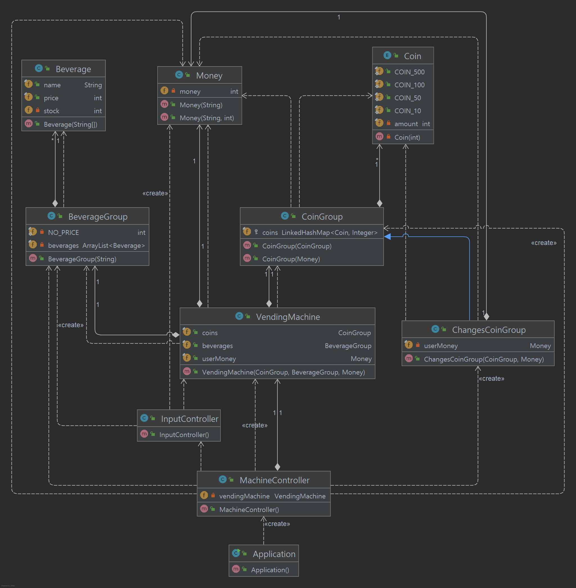

# 🚀 미션 - 자판기

반환되는 동전이 최소한이 되는 자판기를 구현한다

# 📈 기능 목록

## 구현 기능 목록

### ✅ 숫자 셋팅(예외처리) 기능

- [x] 숫자 문자열을 예외처리 해야한다.
    - [x] [예외] 인풋이 없는 경우
    - [x] [예외] 인풋에 숫자 외에 다른 것이 들어온 경우
    - [x] [예외] 인풋의 첫 글자가 0인 경우

### ✅ 돈 셋팅(예외처리) 기능

- [x] 받은 돈 문자열을 숫자 셋팅(예외처리) 해야한다.
- [x] 숫자화 후 금액관련 예외처리를 해야한다.
    - [x] [예외] 금액이 100 미만인 경우
    - [x] [예외] 금액이 10으로 나누어 떨어지지 않는 경우

### ✅ 이름 셋팅(예외처리) 기능

- [x] 상품 이름을 예외처리 해야한다.
    - [x] [예외] 이름이 비어있는 경우
    - [x] [예외] 이름에 문자 외에 다른 것이 들어온 경우
    - [x] [예외] 중복된 이름이 있는 경우

### ✅ 상품 이름&가격&재고 세팅(예외처리) 기능

- 상품명, 가격, 수량은 쉼표로, 개별 상품은 대괄호([])로 묶어 세미콜론(;)으로 구분한다.

- [x] 받은 상품들 문자열 포멧에 맞게 예외처리 해야한다.
    - [x] [예외] 인풋이 없는 경우
    - [x] [예외] 인풋에 문자,숫자,쉼표,세미콜론 외에 다른 것이 들어온 경우
    - [x] [예외] 인풋에 대괄호 쌍이 없는 경우
    - [x] [예외] 인풋의 대괄호 쌍들 사이에 세미콜론 이외의 것이 들어온 경우
    - [x] [예외] 인풋의 대괄호 쌍 사이에 문자,쉼표,숫자 이외의 것이 들어온 경우
    - [x] [예외] 인풋의 대괄호 쌍 사이에 2개의 쉼표가 없는 경우
- [x] 상품 이름을 이름 셋팅(예외처리) 기능으로 예외처리 한다.
- [x] 상품 가격을 돈 셋팅(예외처리) 기능으로 예외처리 한다.
- [x] 상품 개수를 숫자 셋팅(예외처리) 기능으로 예외처리 한다.

### ✅ 자판기 보유금액 입력 받기&저장

- [x] "자판기가 보유하고 있는 금액을 입력해 주세요."을 출력해야 한다.
- [x] 보유금액 입력을 받아야 한다.
- [x] 입력을 돈으로 셋팅(예외처리)한다.
- [x] 입력받은 문자열에서 자판기 보유 금액을 추출한다.
- [x] 자판기 보유 금액을 저장한다.

### ✅ 보유금액을 보유 동전 개수로 변환

- [x] 동전 무작위 생성
    - [x] 보유금액에서 동전 개수를 하나 늘린다
    - [x] 동전 금액만큼 보유금액에서 뺀다.

### ✅ 자판기 안 동전 개수 출력

- [x] "자판기가 보유한 동전"을 출력해야 한다.
- [x] "500원 - n개"을 출력해야 한다.
- [x] "100원 - n개"을 출력해야 한다.
- [x] "50원 - n개"을 출력해야 한다.
- [x] "10원 - n개"을 출력해야 한다.

### ✅ 상품 가격&재고 입력 받기&세팅

- [x] "상품명과 가격, 수량을 입력해 주세요."을 출력해야 한다
- [x] 상품 가격&재고 입력을 받아야 한다.
- [x] 상품 셋팅(예외처리) 기능으로 예외처리 한다.
- [x] 입력받은 문자열에서 개별 상품을 추출한다.
- [x] 개별 상품에서 이름,가격,수량을 추출한다.

- [x] 예외발생 시 에러메세지 출력해야 한다.
- [x] 예외발생 시 다시 입력을 받아야 한다.

### ✅ 투입금액 입력 받기&세팅

- [x] "투입 금액을 입력해 주세요."을 출력해야 한다
- [x] 투입금액 입력을 받아야 한다.
- [x] 입력을 돈으로 셋팅(예외처리)한다.
    - [예외] 투입금액이 상품최소금액보다 적은 경우
- [x] 입력받은 문자열에서 투입 금액을 추출한다.
- [x] 투입 금액을 저장한다.

- [x] 예외발생 시 에러메세지 출력해야 한다.
- [x] 예외발생 시 다시 투입금액 입력을 받아야 한다.

### ✅ 투입금액 출력

- [x] "투입 금액: n원"을 출력해야 한다.

### ✅ 자판기 반복 실행

- [x] 구매할 상품명 입력 받기&세팅 & 투입금액 출력을 반복해야 한다.

### ✅ 구매할 상품명 입력 받기&세팅

- [x] "구매할 상품명을 입력해 주세요."을 출력해야 한다.
- [x] 사용자 입력을 받아야 한다.
- [x] 상품 이름을 이름 셋팅(예외처리) 기능으로 예외처리 한다.
    - [x] [예외] 인풋값의 상품명을 보유하고 있지 않은 경우
- [x] 입력받은 문자열을 상품명으로 저장한다.
- [x] 빈 줄을 출력해야 한다.

- [x] 예외발생 시 에러메세지 출력해야 한다.
- [x] 예외발생 시 다시 사용자 입력을 받아야 한다.

### ✅ 상품 구매

- [x] 다음 경우에 반복을 종료한다.
    - [x] 상품금액이 투입금액보다 많은 경우
    - [x] 해당 상품이 소진된 경우

- [x] 상품금액 만큼 자판기의 돈을 뺀다.
- [x] 상품 개수를 하나 줄인다.

- [x] 다음 경우에 반복을 종료한다.
    - [x] 남은 금액이 상품의 최저 가격보다 적은 경우
    - [x] 모든 상품이 소진된 경우

### ✅ 잔돈 출력

- [x] "투입 금액: n원"을 출력해야 한다.
- [x] 남은 금액으로 반환해야 할 동전종류&개수를 계산한다.
- [x] 동전 종류마다, 자판기 안 보유 동전으로 전부 반환이 가능한지 확인한다.
    - [x] 반환이 가능할 시, 반환한다.
    - [x] 반환이 불가능할 시, 줄 수 있는 가장 높은 동전종류&개수를 반환한 뒤 남은 돈은 자판기에 저장한다.

---

## 🔍구현 로직

- ### Main diagram

- ### Util diagram

- ### View diagram

---

[블로그 후기 링크](https://velog.io/@betterfuture4/우아한-테크코스-백엔드-4기프리코스-3주차-자판기-회고)