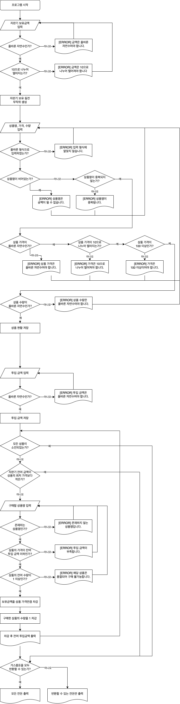

## 🥤 자판기

> 우아한테크코스 4기 3주차 프리코스 과제입니다 :)

원하는 만큼의 금액을 투입하여, 상품을 구매할 수 있는 자판기 프로그램입니다. 프로그램 최초 실행시 사용자는 자판기가 보유하고 있는 금액을 입력합니다. 이때, 자판기가 보유하고 있는 동전의 수는 무작위로 생성되며, 동전의 종류는 `500원`, `100원`, `50원`, `10원` 4가지 입니다.

이후 사용자는 아래의 형태로 `상품명`, `가격`, `수량` 을 입력하여, 자판기가 판매하는 상품 정보를 입력할 수 있습니다.

```
[콜라,1500,20];[사이다,1000,10];[환타,500,20]
```

그다음 사용자는 반복적으로 상품을 구매합니다. 사용자는 상품명을 입력하는 것으로 구매할 수 있으며, 구매수량은 1개로 고정됩니다. 단, 아래의 조건 중 하나라도 만족한 경우 구매 프로세스가 종료됩니다.

### 구매 프로세스 종료 조건

- 모든 상품이 소진된 경우
- 자판기 잔여 금액이 상품의 최저 가격보다 적은 경우

구매 과정이 끝나면, 자판기는 잔돈을 반환합니다. 이때, 보유 동전의 부족함 등의 이유로 모든 금액을 반환할 수 없을 경우 반환할 수 있는 금액만 반환합니다. 또한 반환되지 않은 금액은 자판기에 남습니다.

## 📈 순서도

위 과정을 간략하게 순서도로 정리하면 아래와 같습니다.



## 🖥️ 프로그램 동작 내용

```
자판기가 보유하고 있는 금액을 입력해 주세요.
3000

자판기가 보유한 동전
500원 - 5개
100원 - 4개
50원 - 1개
10원 - 5개

상품명과 가격, 수량을 입력해 주세요.
[제로콜라,1000,10];[환타,2000,5];[칸쵸,500,10]

투입 금액을 입력해 주세요.
3700

투입 금액: 3700원
구매할 상품명을 입력해 주세요.
제로콜라

투입 금액: 2700원
구매할 상품명을 입력해 주세요.
사이다
[ERROR] 입력한 상품명을 가진 상품이 존재하지 않습니다.
구매할 상품명을 입력해 주세요.
환타

투입 금액: 700원
잔돈
500원 - 1개
100원 - 2개
```

## ⚙️ 기능 구현 목록

### 자판기 보유 금액 입력

- [x] 자판기 보유 금액을 사용자로부터 입력 받는다
  - [x] `[예외]` 올바른 자연수 인가?
  - [x] `[예외]` `10` 으로 나누어 떨어지는가?
  - [x] 예외 발생 시 다시 입력받는다.
- [x] 자판기 보유 금액을 만족하도록, 무작위한 동전을 생성한다.
- [x] 생성된 동전을 저장한다.
- [x] 생성된 동전을 출력한다.

### 상품 등록

- [x] 상품명, 가격, 수량을 사용자로부터 입력 받는다
  - [x] `[예외]` 올바른 형식으로 입력하였는가?
  - [x] `[예외]` 상품명이 비어있는가?
  - [x] `[예외]` 상품명이 이미 등록된 상품명인가?
  - [x] `[예외]` 상품 가격이 올바른 자연수인가?
  - [x] `[예외]` 상품 가격이 `10` 으로 나뉘어 떨어지는가?
  - [x] `[예외]` 상품 가격이 `100` 이상인가?
  - [x] `[예외]` 상품 수량이 올바른 자연수인가?
  - [ ] `[예외]` 하나 이상의 상품을 입력하였는가?
  - [x] 예외 발생 시 다시 입력받는다.
- [x] 상품 현황을 저장한다.

### 금액 투입

- [x] 투입 금액을 사용자로부터 입력 받는다
  - [x] `[예외]` 올바른 자연수인가?
  - [x] 예외 발생 시 다시 입력받는다.
- [x] 투입 금액을 저장한다.

### 상품 구매

- [x] 모든 상품의 수량이 `0` 이면, 상품 구매 프로세스를 종료한다.
  - [x] 단일 상품의 품절여부를 검사한다.
  - [x] 모든 상품의 품절여부를 검사한다.
- [x] 잔여 유저 투입 금액이 상품의 최저 가격보다 적으면 상품 구매 프로세스를 종료한다.
- [x] 구매가능한 상품이 모두 수량이 0이면 구매 프로세스를 종료한다.
- [x] 구매할 상품을 사용자로부터 입력 받는다.
  - [x] `[예외]` 상품 목록에 존재하는 상품명인가?
  - [x] `[예외]` 상품의 가격이 잔여 투입 금액 이하인가?
  - [x] `[예외]` 상품의 잔여 수량이 `1` 이상인가?
  - [x] 예외 발생 시 다시 입력받는다.
- [x] 구매한 상품의 가격만큼 보유 금액을 차감한다.
- [x] 구매한 상품의 수량을 `1` 차감한다.
- [x] 상품 구매 프로세스를 반복한다.

### 거스름돈 반환

- [x] 거스름돈을 최소 개수의 동전수로 반환한다.
  - [x] 거스름돈을 모두 반환할 수 없는 경우, 가능한 금액만 반환한다.
- [x] 거스름돈이 없는 경우 안내 문자열을 출력한다.

## 🏗️ 프로젝트 구조

- View
  - InputView : 사용자로 입력을 받아 문자열을 Controller 에 전달
  - OutputView : 상황에 맞는 문자열을 출력하거나, DTO 를 받아와 DTO 의 내용을 출력
- Controller : InputView 에서 받은 문자열을 검증, 파싱 등 전처리 작업을 하여 DTO를 생성하고, 이를 Service 에 전달
- Service : Repository 의 단순 쿼리를 묶어 하나의 트랜지션을 만들어 유의미한 기능 단위를 제공
- Repository : 저장되어야 하는 데이터를 담고 있으며, 단순 쿼리 (CRUD) 를 제공
- Domain : 모든 비즈니스 로직을 가짐. DTO 의 내용을 검증하고 정제

## 🤔 시도해본 것들과 원칙

> 프리코스 기간 중 자바와 객체지향, 디자인 패턴을 공부하면서 알게된 것들 혹은 경험적으로 느꼈던 부분, 그리고 그것들을 실제로 3주차 프리코스 프로젝트에 적용한 내용을 정리합니다.

- **사용자 입장에서 프로그램 순서도 그리기**

  프로그램 복잡도가 상승하기도 하였으며, 요구사항에 기재되지 않은 내용은 스스로 판단하여 구현하여야 했으므로, 개발 전에 프로그램 전체 프로그램의 흐름을 정리하기 위해 작성하기 위해 작성하였습니다. 실제로 개발 할 때 도움이 되었습니다.

- **모든 클래스의 생성자를 숨기고, 정적 팩토리 메소드 구현**

  > 생성자 대신 정적 팩토리 메소드를 고려하라 - Effective Java

  생성자는 순수하게 객체가 필요한 멤버 변수만을 파라미터로 받아 객체를 생성하는데 집중하게끔 하였습니다. 데이터 타입에 따른 값 검증 등 데이터에 대한 전처리 작업은 모두 정적 팩토리 메소드에게 위임하였습니다. 이름을 갖고있는 메소드를 통해 객체를 생성하여 가독성이 의미있게 증가했습니다. 단, Controller 와 Service 는 생성시 별도의 파라미터를 받지 않으므로, 적용대상에서 제외하였습니다.

- **Repository 의 생성은 싱글턴 패턴으로**

  싱글턴 패턴은 프로그램 런타임 중 해당 객체가 단 한번만 생성됨을 보장할 때 사용하는 패턴입니다. Repository 는 데이터를 관리하는 계층입니다. Repository 를 두번 이상 생성할 수 있도록 허락하면, 데이터의 무결성이 깨질 수 있을 것 이라고 판단되어 Repository 객체는 싱글턴 패턴으로 생성하도록 구현하였습니다.

  > 참고 : https://tecoble.techcourse.co.kr/post/2020-11-07-singleton/

- **도메인 별 Validator 클래스 분리**

  도메인 클래스안에 검증로직까지 존재하면, 도메인 내부에 비즈니스 로직과 관련 없는 코드가 존재하므로 가독성이 낮아짐을 느꼈습니다. 이에 따라 검증 로직은 Validator 를 분리하고, Validator 내부에서 Error 를 Throw 하도록 개선하였습니다.

- **별개의 Exception 클래스 정의**

  각각의 예외상황에 따라 메세지 상수도 각 Exception 클래스가 관리하고, 개발자 입장에서는 어떤 오류인지 쉽게 알 수 있을 것이라고 판단하였습니다. 따라서 `exception` 패키지를 만들어 별개로 구현하였습니다.

- **레이어간 데이터 통신은 DTO 를 사용**

  InputView 에서 Controller 에게 String 으로 입력값을 전달하면, Controller 에서는 입력값을 파싱하고, 형변환하는 전처리 작업을 거쳐 DTO 를 생성합니다. 생성된 DTO 는 Controller 에서 Service 로 전달됩니다. Service 는 DTO 의 `toEntity` 메소드를 통해 도메인 객체로 변환하고, 기능을 수행합니다. 반대로 데이터의 출력이 필요할 때에는 Service 가 Repository 로부터 받아온 도메인 객체를 DTO 로 변환한다음 Controller 에 전달하고, Controller 는 DTO 를 다시 View 에 전달해 출력하도록 구현하였습니다. DTO 와 Entity 변환이 Controller 와 Service 사이에서 이루어진다는 원칙을 만들고, 지켰습니다.

  > 참고 : https://tecoble.techcourse.co.kr/post/2021-04-25-dto-layer-scope/

- **toString 의 재정의**

  > toString 을 항상 재정의하라 - Effective Java

  toString의 일반 규약에 따르면 '간결하면서 사람이 읽기 쉬운 형태의 유익한 정보'를 반환해야 합니다. 이미 깔끔한 구조로 포매팅 되어 재정의된 Enum, HashMap 과 같은 것들 외의 도메인 객체는 모두 toString 메소드를 재정의해줬습니다. 실제로 Human-Readable 하게 객체를 출력할 수 있어 개발 효율이 증가됨을 느꼈습니다.

- **`TODO:` 코멘트를 활용**

  추후 적용이 필요한 것들이나 고민이 필요한 것들, 개선이 필요해보이는 것들을 `TODO: ` 주석을달아 관리하였습니다. 별도의 이슈트래커를 사용하면 좋겠지만, IntelliJ 에서 지원하는 기능을 최대한 활용해보고 싶어 사용해보았습니다.

- **Domain 객체가 모든 비즈니스 로직을 처리**

  > 객체는 자율적이고 협력적이어야 한다 - 객체지향의 사실과 오해

  처음에는 Service 레이어와 Domain 레이어 중 어디서 비즈니스 로직을 구현할지 많은 고민을 하였습니다. 하지만, Service 에서 비즈니스 로직을 작성하다보니, 도메인 객체는 단순한 데이터 덩어리가 된 것 같은 느낌을 지울 수가 없었습니다. 따라서, Service 는 도메인의 비즈니스 로직을 실행하는 순서만 보장하도록 하고, 실제 비즈니스 로직은 모두 도메인 레이어에서 담당하도록 작성하였습니다.

  > 참고 : https://nocount.tistory.com/170

- **Controller 는 View 와 Model 의 중간 역할만 하도록**

  이전 1, 2주차 프리코스에서는 Controller가 모든 게임의 흐름을 담당했는데, Controller는 단순히 View 와 Model 사이의 중계 여역할만 하는 것이 옳다고 생각이 들었습니다. 따라서 게임의 흐름은 [Application.java](http://application.java/) 에서 담당하도록 코드를 작성하였습니다.

- **모든 예외처리는 Controller 에서 하도록**

  어떤 레이어에서든 Exception 이 던져질 수 있지만, 그 Exception 을 처리하는 레이어는 모두 Controller 가 되도록 코드를 작성하였습니다. 처음에는 모든 검증과 Exception Throwing 이 도메인 레이어에서만 동작해야한다는 오해를 가지고 있었는데, 그 강박에서 벗어나니 좀 더 유연한 코드를 작성할 수 있게 된 것 같습니다.
  그리고 이런 원칙을 적용하니, 지난번에는 InputView 에서 예외를 핸들링하고 재입력 받도록 하던 어색한 코드가 Controller 로 이양되어 좀 더 책임범위가 명확해진 것 같습니다.

- **상수는 별개의 클래스로 분리하지 않음**

  상수는 상수를 사용하는 클래스 안에서 정의되는 것이 가독성과 유지보수 측면에서 옳다 생각하여 적용한 원칙입니다.

- **원시타입을 모두 VO 로 Wrapping**

  이를테면 상품의 이름, 가격, 개수 등을 모두 VO(Value Object) 로 Wrapping 했습니다. 해당 값의 변경이 필요하면, 직접 값을 변경하는 것이 아니라 새로운 값을 가지고 있는 객체를 생성해서 교체하도록 하여 불변성을 지키도록 하였습니다. 또한 `hashCode` 와 `equals` 를 재정의 하여 동등성을 갖도록 하였습니다. 이렇게 원시타입을 VO로 감싸면 Entity 뿐 아니라 속성 스스로도 값을 검증할 수 있어 코드가 한층 더 깔끔해지는 것 같습니다.

- **Comparable 인터페이스 사용**

  상품가격의 VO 인 `ItemPrice` 에 `Comparable` 인터페이스를 구현하고, `compareTo` 를 오버라이딩 하여, 쉽게 대소를 비교할 수 있도록 구현하였습니다. 이는 `Collections.min` API 를 사용할 때 유용하게 사용되었습니다.

