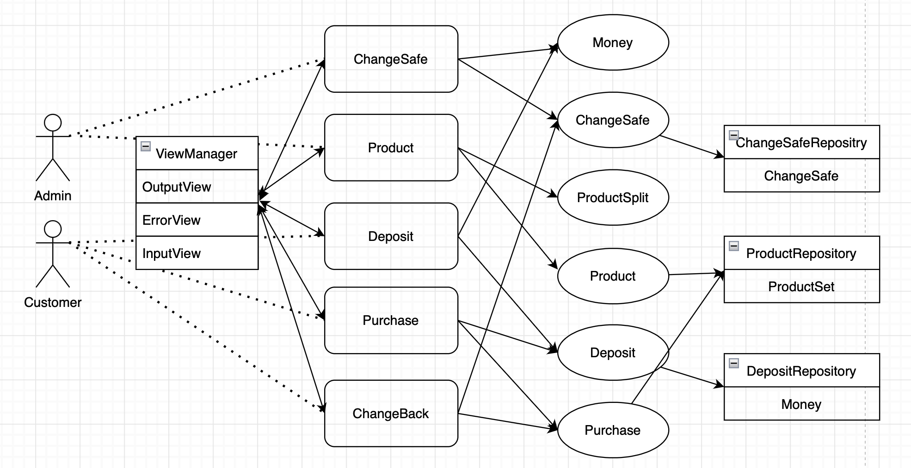

# MVC + 레이어드 아키텍쳐를 채택한 이유

이번 미션을 진행하면서 저는 다음 그림과 같이 MVC 패턴 + 레이어드 아키텍쳐의 형태로 코드를 설계하였습니다. 

미션 요구사항을 보고 가장 먼저 떠오른것은 "잔돈", "상품" 등의 "데이터를 저장할 공간이 필요하다"는 것이었는데요. 본 미션에서는 데이터베이스와 같은 별도의 저장공간이 존재하지 않기 때문에, 입력받은 데이터(자판기 내 잔돈, 상품 등)가 메모리상에 상주해야 합니다. 하지만 메소드가 끝나면 stack에 있던 임시 값은 접근이 불가능해지고 `Garbage Collection` 의 대상이 되는 문제가 발생합니다.   
	
현재로써 이러한 문제를 해결하는 방법은 두가지가 있는데요.
1) 필요한 데이터를 하위 stack 메모리에 할당한다.
2) 정적 변수로 선언하여 프로그램이 종료될 때까지 메모리를 할당한다.

다른말로 표현하면, 
1) 데이터를 main method 에 최대한 가깝게 위치시킨다.
2) 데이터를 별도의 공간에 저장한다.

라고 표현할 수 있습니다. 조금 더 구체적으로 설계해보자면,  
1번의 경우 초기에 VendingMachine을 생성하려는 메소드를 호출하고, 계속해서 그 내부를 호출해나가다가, 필요한 시점에 "보유할 잔돈의 입력"을 받습니다. 입력값을 바탕으로 잔돈을 생성하고, 다음으로 "등록할 상품"을 입력받습니다. 역시 이 입력값을 바탕으로 상품을 생성합니다. "금액의 투입"과 "상품의 구매" 또한 이와 같은 흐름으로 이어지겠죠.

반대로 2번의 경우, 우선 "보유할 잔돈"의 __입력부터__ 받습니다. 이 입력값을 바탕으로 잔돈을 생성하고, static 변수에 저장합니다. 마찬가지로 "등록할 상품" 또한 입력부터 먼저 받아내고, 이를 바탕으로 상품을 등록합니다. 

얼핏 보면 입력을 받는 부분이 앞이냐 뒤이냐 외에는 큰 차이가 없어보이는 두 가지 선택지중, 저는 2번을 선택하였는데, 그 이유는 다음과 같습니다.

### A. 웹 서비스로 변경된다면 ?
만약 요구사항이 변경되어서 웹서비스로 변경된다면 어떨까요? 아마 접속하자마자 대뜸 "잔돈을 입력해주세요" 라는 화면이 나타나기보다는,  여러 개의 버튼이 있어서 "잔돈 입력"을 누르면 잔돈을 입력할 수 있는 화면이 나오는 것을 상상해볼 수 있습니다.

(특히 이런 모달창으로 이런 식으로 잔돈을 입력하는 것은 별로겠죠.)

말인 즉슨, "실행 순서를 사용자 마음대로 정하고싶다" 라는, 즉 "메뉴에서 위 로직을 선택할 수 있도록 하고싶다." 는 요구사항이 추가되는 것이죠.

전자의 경우 잔돈입력, 상품등록, 금액투입, 상품구매의 로직이 프로그램의 내부 깊숙히 박혀있는 상황인데요. 그렇기 때문에 이를 해결하려면 VendingMachine의 생성보다 더 앞쪽에서 "메뉴 선택"이라는 기능을 추가해야 합니다. 그러면 "입력을 받는다" 라는 로직이 프로그램의 초반과 후반에 동시에 존재해서 "Layer의 구분", 즉 MVC 패턴이 깨지게 됩니다. 

### B. "요구하는 것"이 아니라 "요청에 반응"해야 한다.
위 A와 비슷한 이야기인데요. 현실세계의 자판기를 생각해보면, 우리가 "금액을 투입" 하는 행위에 반응해서 구매할 수 있는 상품을 보여줍니다. 상품을 구매하려고 "버튼을 누르는" 행위에 반응해서 상품을 돌려주죠.

하지만 현재 프로그램은 "잔돈 입력"과 "상품 등록"까지만 진행하면 대뜸 자판기가 우리에게 금액을 투입할 것을 요구합니다. (물론 미션 자체에서 요구사항이 그런식으로 작성되어있기만 하지만요.)

객체지향의 협력 관점에서 생각해보면, A 객체가 B 객체에게 "무언가를 해달라"고 요청을 하고, B 객체는 그에 반응해서 "알아서" 특정 행위를 수행합니다. 마치 자판기가 버튼 클릭에 반응하는 것과 같죠.

하지만 프로그램 내부 깊숙한 곳에서 사용자로부터 입력을 받으면, "프로그램이 사용자에게 요구하는 꼴"이 되어버립니다. 이는 자연스러운 흐름이라고 보기 어렵습니다.

### C. 인스턴스 변수가 많아진다.  
현재 "상품 구매"를 위해 필요한 요소는 "잔돈", "상품", 그리고 "투입금액" 입니다. 세 개정도라면 어느정도 눈감아줄 수 있지만, 만약 더 다양한 서비스가 추가되고, 그에 따라 더 다양한 요소가 준비되어야 하는 상황이라면, 자연스럽게 더 많은 인스턴스/지역 변수를 들고 있게 됩니다. 이는 2주차 피드백에서도 확인했듯이 버그가 많아질 가능성이 높아지기도 하고, 또 코드를 읽는 사람도 이해하기 어려워지는... 별로 기분좋은 상황은 아니게 됩니다. 

--....

후자를 선택하는 경우에는, 위와 같은 문제를 다음과 같이 해결해줍니다.

### A. 웹 서비스로 변경된다면 ?  
위 그림과 같은 아키텍쳐를 채택하는 경우, 수정해야 할 부분은 그리 많아지지 않습니다. View와 연관된 입출력은 외부에서 들어올테니까, 그 뒷부분인 Controller, Service, Repository 영역은 수정할 필요가 없습니다.

### B. "요구하는 것"이 아니라 "요청에 반응"해야 한다.
역시 마찬가지로, 웹 상의 "사용자"가 어떤 View를 보고, 우리에게 요청을 보내게 된다면, 그에 걸맞는 Controller가 반응하여 이에 대응할 수 있습니다. 

### C. 인스턴스 변수가 많아진다.  
잔돈, 상품, 투입금액이라는 세 개의 변수는 서로 다른 Repository에서 독립적으로 존재하고 있습니다. 즉, 각 Repository가 해당 변수의 생명을 관리하고 있죠. 각 객체간의 협력이 필요해지면 Repository로부터 꺼내서 Service에서 적절하게 조합하여 비즈니스 로직을 수행하면 됩니다.

하지만 다음과 같은 단점이 있습니다.

## A. 구현이 까다롭다.
실행 순서에 관계없이 모두 만족시켜주려면, 즉, 잔돈이나 상품이 들어오기 전에 상품을 구매하려는 상황이 나오는 상황을 상상해봅시다. 당연히 "구매할 상품이 없습니다" 와 같은 멘트가 나오는 것을 기대해야겠죠. 즉, 그런 상황까지 고려해서 코드를 작성해야합니다.

-----

# 그래서

제가 개인적으로 생각하는 "좋은 코드"의 핵심 가치 두 가지는 "변경이 용이한 코드" 와 "읽기 좋은 코드" 입니다. 이러한 아키텍쳐를 따르지 않더라도 "읽기 좋은 코드"를 만들 수는 있으나, "변경이 용이한 코드"를 만들어내기는 어려울 것이라고 판단하여, 비록 구현이 조금 까다롭더라도 "변경이 용이한 코드"까지 잡아낼 수 있는 레이어드 아키텍쳐를 선택하였습니다.
