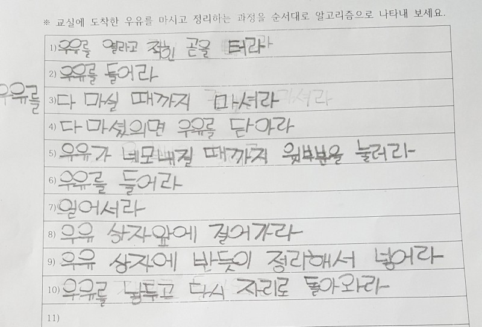

# 1. 배운 점

본 프리코스 과정에서 TDD에 관해서 언급되지는 않았지만, 스스로 TDD에 도전해보고 또 실패한 경험으로부터 스스로 다음과 같이 정리하였습니다.

1. TDD는 추상화/구체화에 도움을 준다.
	
	- 기능 요구사항을 정리하는 것과 마찬가지의 맥락으로, TDD 또한 "내가 어디서부터 시작하고, 어디서 끝맺어야하는지" 에 대한 구체화에 도움을 주었습니다. 우유를 마시는 알고리즘이 "우유를 마신다" 라는 한 문장으로 끝나는 것이 아니라, 구체적으로 어떻게 수행되어야 하는지 명확하게 정의하듯이, TDD 또한 구체적으로 
	__"이 객체가 알고 있는 것을 언제까지 수행하고, 모르는 것을 언제부터 요청해야하는가?"__ 에 대해서 머릿속으로 정리하는데 도움을 주었습니다.
2. TDD는 객체간의 협력의 힌트를 얻을 수 있다.  
	- 위 1번의 장점 덕에, TDD는 특정 객체를 호출하는 다른 객체의 대리인 역할로서, "내가 호출하는 객체로부터 원하는것이 무엇인지?" 에 대해서 아주 명확하게 요구합니다. 해당 객체가 수신해야할 메시지가 무엇인지 정의하고, 그로부터 원하는 결과가 무엇인지 정의함으로서 해당 객체에게 책임을 부여할 수 있게 됩니다. 
3. TDD는 변화에 견고하다.
	- 코드를 수정하고나서, 직접 사람이 하나씩 손으로 테스트를 하지 않을 수 있습니다. 물론 코드를 먼저 작성하고 테스트를 작성하더라도 같은 효과를 얻을 수 있는데요. 코드를 먼저 작성할 경우에는, "해당 코드가 어떻게 동작할지 알고 있기 때문에" 그에 걸맞는 테스트, 즉 _틀린 테스트를 작성할 가능성_ 이 있습니다. TDD는 이러한 부분을 방지해줄 수 있다고 생각합니다.

# 2. 어려웠던 점

아직 설계에 익숙하지 않아서 그런지, 기능 요구사항을 코드 아키텍쳐 관점에서 정리하기가 어려웠습니다. 기능 요구사항의 카테고리를 분류하고 각 카테고리별로 하나씩 커밋을 수행하려고 노력했습니다만, 대개의 경우 한 번의 커밋에 여러개의 요구사항이 구현된다던지, 혹은 하나의 클래스가 서로 다른 구현사항으로부터 변경되는 상황도 종종 발생했습니다. 이는 아직까지 요구사항을 확실하게 정리하지 못한다는 반증이라고 볼 수 있습니다. 

# 3. 느낀 점

프리코스를 시작한지 얼마 되지 않은 것 같은데 벌써 마지막 과제를 제출하려니 조금 아쉬운 마음입니다.

마지막 과제를 제출하면서 드는 첫 번째 생각은, 단순히 코드를 작성하는 방법론 뿐만 아니라 스스로 성장할 수 있는 방법에 대해서도 배운 것 같다는 점입니다. 기존에는 학습 방법이 '다른 사람 것을 보고 따라하며 배운다'가 주를 이루었습니다. 그러다보니 점점 코드를 복사하고 붙여넣는 것과 다를바가 없어지게 되고, 나태해졌습니다.

어떤식으로 코드를 작성하느냐에는 정답이 없지만, 나만의 정답은 있다고 생각합니다. 즉, 내가 왜 이렇게 작성했는지 설명할 수 있고, 이를 남들이 납득할 수 있어야 한다고 생각합니다. 이번 프리코스를 진행하면서 받은 피드백, 구글링, 책을 기존과 같이 단순히 "따라하고 받아들이는 것"에서 멈추지 않고, `"왜?"` 라는 질문을 스스로 되뇌이며 고민하고, 논리를 세우고, 또 그에 대한 결론을 내리는 법을 터득한 것 같아, 저에게는 짧지만 아주 임팩트 있는 3주였다고 생각합니다.

이와 더불어 과거에는 최선이라고 생각해서 더 이상 고칠점이 없다고 생각했는데, 매 미션이 끝나고 다음 미션을 시작할 때쯤에는 "아 이렇게 했어야 했는데" 라는 생각이 들면서, 홀로 성장했다는 성취감을 크게 맛볼 수 있었습니다. 특히 가장 많이 고민하고, 또 발전했다고 생각하는 부분은 아키텍쳐와 관련된 부분입니다. 거의 대부분의 시간을 "어떻게하면 유연한 구조로 작성할 수 있을까?" 를 고민했습니다. 기존에 피상적인 지식으로 머릿속에 담고만 있었던, 좋은 코드를 작성하기 위한 SOLID와 같은 원칙, 객체와 책임 등.. 와닿지 않던 이야기들이 미션을 구현하면서 비로소 스스로 체감할 수 있었다고 생각합니다.

이번 과제를 통해 "이정도면 됐어" 라며 안주하는 잘못된 습관을 고치고, 또 스스로 눈을 뜨고 깨어서 "의식적인 연습" 이라는 것을 크게 배울 수 있는 기회가 되어 정말 감사하다는 말씀 드리고 싶습니다.

이찬주 드림.
